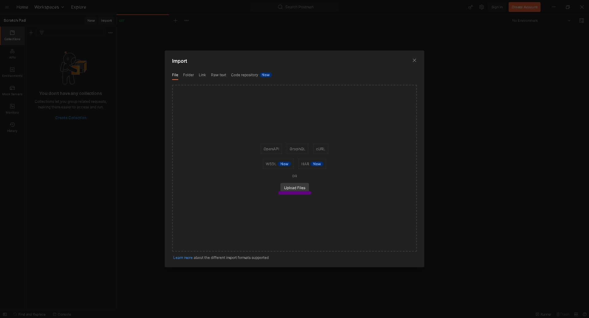
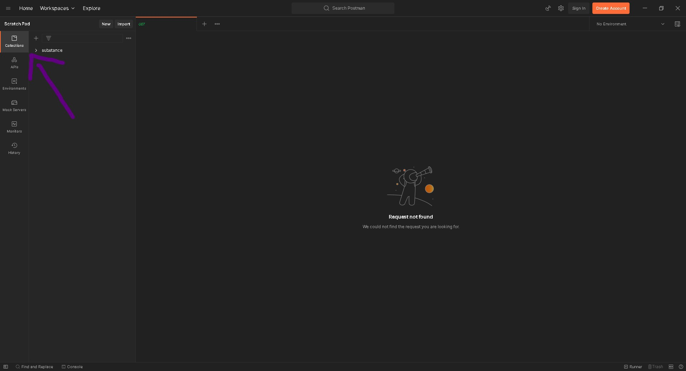
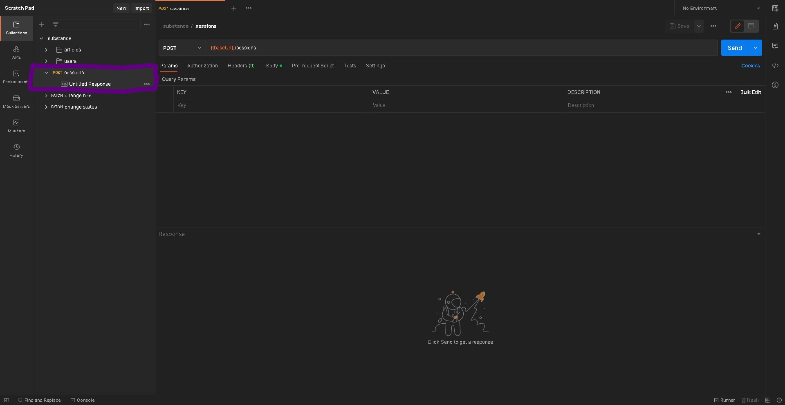
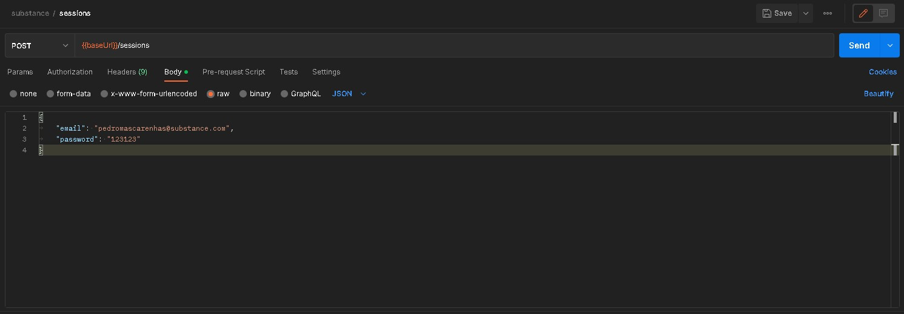
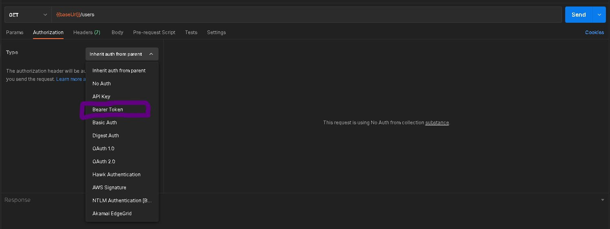
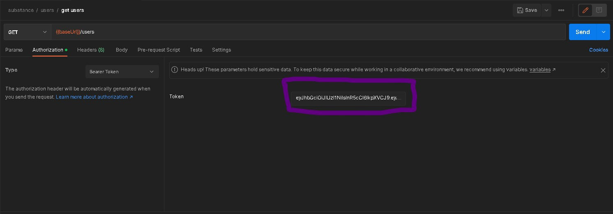
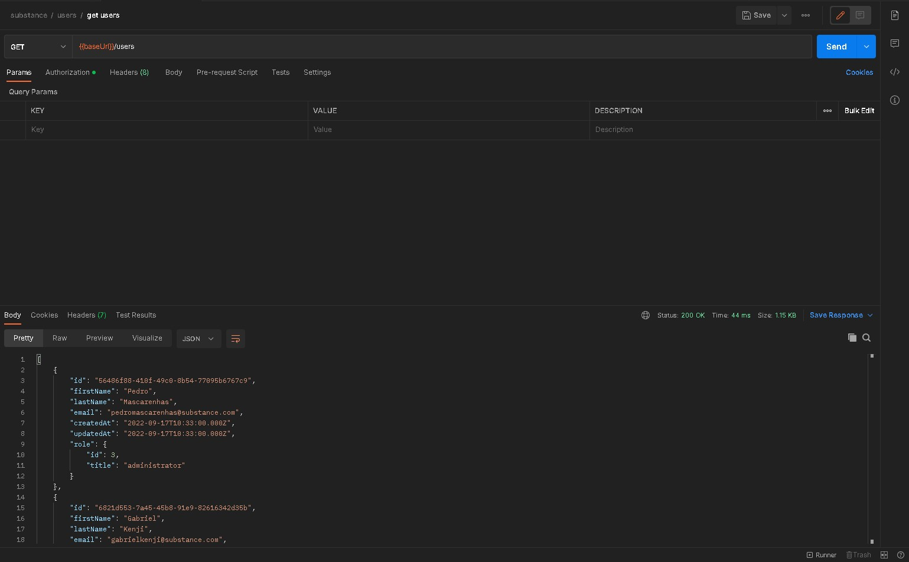

<p align="center">
  <a href="#technologies">Tecnologias</a>&nbsp;&nbsp;&nbsp;|&nbsp;&nbsp;&nbsp;
  <a href="#requirements">Pré-Requisitos</a>&nbsp;&nbsp;&nbsp;|&nbsp;&nbsp;&nbsp;
  <a href="#docs">Documentação</a>&nbsp;&nbsp;&nbsp;|&nbsp;&nbsp;&nbsp;
  <a href="#run">Como executar</a>&nbsp;&nbsp;&nbsp;
</p>

<h1>🎯 Sobre o projeto</h1>

<p>Nosso objetivo é tornar fácil o acesso a criação, publicação e leitura de artigos científicos de qualidade, que sejam aprovados pela comunidade.</p>

<h2 id="technologies"> 🛠️ Tecnologias</h2>

<a href="https://nodejs.org/en/"></a>
<a href="http://expressjs.com/pt-br/"></a>
<a href="https://www.mysql.com/"></a>
<a href="https://sequelize.org/"></a>
<a href="https://www.docker.com/"></a>
<a href="https://eslint.org/"></a>
<a href="https://prettier.io/"></a>
<a href="https://typicode.github.io/husky/#/"></a>
<a href="https://swagger.io/"></a>

<h2 id="requirements">⚡ Pré-Requisitos</h2>

<p>Você vai precisar ter instalado em sua máquina as seguintes ferramentas:</p>

<a href="https://git-scm.com/"></a>
<a href="https://nodejs.org/en/"></a>
<a href="https://www.docker.com/"></a>

<h1 id="docs">Documentação</h1>

<a href=""></a>
<a href=""></a>
<a href=""> <br/><br/></a>

### Api Endpoints

Breve descrição dos endpoints da aplicação.

<details>
  <summary>Sessions</summary>
 <br>
  
  Utilizado para logar e obter o token de autenticação  
  ``` ruby
  POST /sessions
  ```  
</details>
<details>
  <summary>Articles</summary>
 <br>  
  
  Retorna uma lista de artigos 
  ``` ruby
  GET /articles
  ```   
  Salva um artigo
  ``` ruby
  POST /articles
  ```
  Retorna um artigo pelo id
  ``` ruby
  GET /articles/{id}  
  ```
  Atualiza um artigo
  ``` ruby
  PUT /articles/{id}  
  ```
  Deleta um artigo
  ``` ruby
  PUT /articles/{id}  
  ```
</details>
<details>
  <summary>Users</summary>
 <br>  
  
  Retorna uma lista de usuários 
  ``` ruby
  GET /users
  ```   
  Salva um usuário
  ``` ruby
  POST /users
  ```
  Retorna um usuário pelo id
  ``` ruby
  GET /users/{id}  
  ```
  Atualiza um usuário
  ``` ruby
  PUT /users/{id}  
  ```
  Deleta um usuário
  ``` ruby
  PUT /users/{id}  
  ```
</details>
<details>
  <summary>Administrators</summary>
 <br>  
  
  Altera a função de um usuário 
  ``` ruby
  PATCH /administrators/{id}
  ```   
</details>
<details>
  <summary>Proofreaders</summary>
 <br>  
  
  Altera o status de um artigo 
  ``` ruby
  PATCH /proofreaders/{id}
  ```   
</details>
<br>

<h1 id="run">🚀 Como executar ?</h1>

<h2>🐳 Execute com o Docker</h2>

🚨 Configure as variáveis ambiente alterando o arquivo `.env.example` para `.env`

```bash
# Clone o repositório
$ git clone https://github.com/pedro-drosa/substance.git

# Inicie os containers

$ docker-compose up

# Agora você pode acessar

$ http://localhost:5000

```

<h2>⚡ Execute sem o Docker</h2>

```bash
# Clone o repositório
$ git clone https://github.com/pedro-drosa/substance.git

# Instale as dependências
$ npm install

# Inicie o servidor
$ npm run dev

# Você deve ter o Mysql devidamente configurado em sua máquina para continuar...
# Lembre-se de configurar seu usuário e senha!

# Crie a base de dados
$ npx sequelize-cli db:create

# Execute as migrações
$ npx sequelize-cli db:migrate

# Adicione os seeds
$ npx sequelize-cli db:seed:all

# Agora você pode acessar
$ http://localhost:5000
```

<h1 id="postman">Postman</h1>
- Primeiro, importe o <a href="swagger.json">arquivos</a>.
</br>
- Abra o Postman, clique em <strong>`File`</strong> -> <strong>`Import`</strong> -> <strong>`File`</strong> -> ,<strong>`Upload files`</strong>.
</img>
</br>
- Depois de importar o arquivo, clique em <strong>`Colections`</strong>.
</img>
</br>
- A partir daqui você consegue testar a nossa API ! Para isso, entre em <strong>sessions</strong>.
</img>
</br>
- Coloque as credenciais do usuário e clique em <strong>`Send`</strong>.
</img>
</br>
- Com o token gerado no passo anterior, você consegue acessar as APIs.
<p><li>Clique em <strong>Authorization</strong></li></p>
</img>
</br>
<p><li>Cole o token no campo.</li></p>
</img>
</br>
- Clique em <strong>send</strong> e pronto, está rodando :smile: .
</img>
